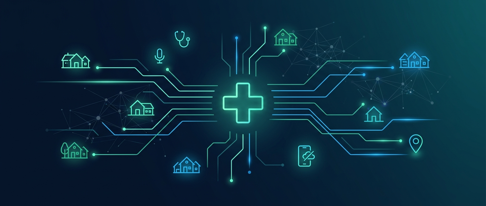
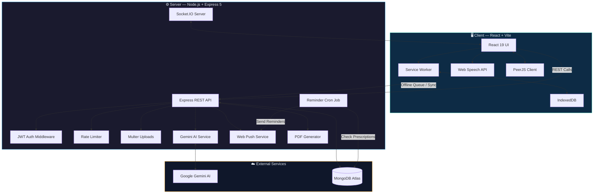

<p align="center">
  
</p>

<h1 align="center">🏥 AI Rural Healthcare System</h1>

<p align="center">
  <strong>Bridging the healthcare gap in rural India — one village at a time.</strong><br/>
  An AI-powered, offline-first platform that connects ASHA workers, patients, and doctors through intelligent triage, multilingual voice support, and real-time priority queuing.
</p>

<p align="center">
  <a href="https://github.com/Amar-cod/AI-Rural-Healthcare-System"></a>
  <a href="https://github.com/Amar-cod/AI-Rural-Healthcare-System"></a>
  <a href="https://github.com/Amar-cod/AI-Rural-Healthcare-System"></a>
  <a href="https://github.com/Amar-cod/AI-Rural-Healthcare-System"></a>
  <a href="https://github.com/Amar-cod/AI-Rural-Healthcare-System"></a>
  <a href="LICENSE"></a>
</p>

<p align="center">
  <a href="#-key-features">Features</a> •
  <a href="#-screenshots">Screenshots</a> •
  <a href="#-system-architecture">Architecture</a> •
  <a href="#-getting-started">Getting Started</a> •
  <a href="#-demo-walkthrough">Demo</a> •
  <a href="#-api-reference">API</a> •
  <a href="#-contributing">Contributing</a>
</p>

---

## 🩺 The Problem

> **900 million+ rural Indians** depend on a fragmented healthcare system plagued by doctor shortages, overwhelming patient loads, and crushing language barriers.

ASHA (Accredited Social Health Activist) workers — the frontline of India's public health system — operate in areas with poor internet connectivity and lack digital tools to efficiently triage, track, and escalate patients. The result: **delayed interventions for critical cases** and preventable deaths.

## 💡 Our Solution

This platform creates a **digital continuum of care** from the village floor to the doctor's desk:

| Layer | What It Does |
|---|---|
| 🏘️ **Field** | ASHA workers register patients and log vitals **offline** — data auto-syncs when connectivity returns |
| 🗣️ **Triage** | Patients describe symptoms via **voice or text in 12 Indian languages** — AI collects, summarizes, and flags red-flag cases |
| 🏥 **Clinical** | Doctors receive an **AI-prioritized queue** (Critical → Routine) with full patient histories, ASHA records, and photos |
| 💊 **Follow-up** | Automated **push notification reminders** ensure medication adherence |

---

## 📸 Screenshots

<p align="center">
  
  <br />
  <strong>Doctor Priority Dashboard</strong> — AI-powered patient queue sorted by urgency with village-level filtering
</p>

<p align="center">
  
  <br />
  <strong>AI Symptom Assistant</strong> — Multilingual voice & text triage powered by Google Gemini
</p>

<p align="center">
  
  <br />
  <strong>ASHA Worker Dashboard</strong> — Offline-first patient registration and village management
</p>

---

## ✨ Key Features

### 🗣️ Multilingual Voice AI Triage
- **Voice & Text in 12 Languages** — English, Hindi, Tamil, Telugu, Bengali, Kannada, Marathi, Gujarati, Malayalam, Punjabi, Odia, and Urdu via Web Speech API
- **Intelligent Symptom Collection** — AI asks focused follow-ups, then generates a structured summary for the doctor
- **Red Flag Detection** — Critical keywords (chest pain, severe bleeding, seizures, etc.) immediately trigger hardcoded emergency warnings and escalate priority to **Critical**
- **Safety Boundaries** — The AI **never diagnoses or prescribes**; it strictly performs intake triage

### 📶 Offline-First ASHA Field App
- **Works Without Internet** — Patient registration and vital logging work entirely offline using **IndexedDB**
- **Transparent Background Sync** — Service Workers queue local data and silently sync to the server upon reconnection
- **Village Management** — Dedicated views for ASHAs to manage residents in their assigned villages
- **Photo & Report Uploads** — Capture and attach field photos with image compression for low-bandwidth environments

### 🏥 Doctor Priority Dashboard
- **AI-Powered Priority Queue** — Patients sorted by urgency: `Routine` → `Medium` → `High` → `Critical`
- **Village-Level Filtering** — Spot geographic health trends and filter queues by village
- **Comprehensive Patient History** — Tabbed interface combining AI consultation summaries, ASHA field records, uploaded photos, and past prescriptions
- **Real-Time Updates** — Socket.IO powers live queue updates without page refresh

### 💊 Automated Medication Reminders
- **Cron-Based Monitoring** — Background jobs periodically check active prescriptions
- **Web Push Notifications** — Patients receive timely reminders to take their medications
- **Prescription PDF Generation** — Doctors can generate downloadable prescription documents

### 🔑 Role-Based Access Control
| Role | Capabilities |
|---|---|
| **Admin** | Create villages, register/assign ASHA workers, view system-wide statistics |
| **ASHA Worker** | Manage village residents, register patients, log vitals, upload photos (offline-capable) |
| **Patient** | AI symptom triage (voice/text), medication reminders, view prescriptions & reports |
| **Doctor** | Priority queue, village filtering, AI summaries, ASHA records review, write prescriptions |

### 🩻 Telemedicine
- **Video Consultations** — PeerJS-based video calling between doctors and patients
- **Real-Time Signaling** — Socket.IO manages call initiation, acceptance, and termination

---

## 🏗 System Architecture



> 📖 *For a deep dive, see the [Architecture Documentation](docs/architecture.md) and [Phase 2 Architecture](docs/architecture-phase2.md).*

---

## 🛠 Tech Stack

| Layer | Technologies |
|---|---|
| **Frontend** | React 19, Vite 8, Tailwind CSS 3, React Router 7, i18next, Lucide Icons |
| **Offline** | Service Workers, IndexedDB (via `idb`), Background Sync |
| **Backend** | Node.js 18+, Express 5, Socket.IO 4 |
| **Database** | MongoDB Atlas, Mongoose 9 |
| **AI Engine** | Google Gemini Flash (via `@google/generative-ai`) |
| **Auth** | JWT (jsonwebtoken), bcryptjs |
| **Services** | Web Push, Multer (uploads), PDFKit, PeerJS (video calls) |
| **DevTools** | OxLint, Vite HMR, PostCSS, Autoprefixer |

---

## 📂 Project Structure

```text
AI Rural Healthcare System/
│
├── 📁 client/                          # React frontend (Vite)
│   ├── public/                         # Static assets, Service Worker
│   └── src/
│       ├── components/common/          # Shared UI components (ProtectedRoute, etc.)
│       ├── context/                    # React Context (AuthContext)
│       ├── features/                   # Feature-based modules
│       │   ├── admin/                  #   Admin dashboard & village management
│       │   ├── asha/                   #   ASHA worker offline dashboard
│       │   ├── auth/                   #   Login & registration
│       │   ├── doctor/                 #   Doctor priority dashboard
│       │   ├── patient/                #   Patient AI assistant, reminders, medicine requests
│       │   └── telemedicine/           #   PeerJS video consultation room
│       ├── lib/                        # Utility libraries
│       └── i18n.js                     # Internationalization config (12 languages)
│
├── 📁 server/                          # Node.js Express backend
│   ├── scripts/                        # Database seeding & migration scripts
│   └── src/
│       ├── controllers/                # 14 route handlers
│       ├── cron/                       # Scheduled reminder jobs
│       ├── data/                       # Static data & seed fixtures
│       ├── middleware/                  # JWT auth, Multer upload, rate limiting
│       ├── models/                     # 15 Mongoose schemas
│       ├── routes/                     # 15 Express route files
│       ├── services/                   # Gemini AI, Web Push, PDF generation
│       ├── server.js                   # App entry point
│       └── socket.js                   # Socket.IO initialization
│
├── 📁 docs/                            # Documentation & screenshots
│   ├── architecture.md                 # System architecture (Phase 1)
│   ├── architecture-phase2.md          # Phase 2 architecture
│   ├── prd.md                          # Product Requirements Document
│   ├── design.md                       # Design specifications
│   └── screenshots/                    # App screenshots
│
├── .gitignore
├── LICENSE                             # MIT License
└── README.md                           # ← You are here
```

---

## 🚀 Getting Started

### Prerequisites

| Requirement | Version | Notes |
|---|---|---|
| **Node.js** | 18.x+ | [Download](https://nodejs.org/) |
| **MongoDB** | 6.x+ | Atlas (recommended) or local instance |
| **Gemini API Key** | — | [Get one free](https://aistudio.google.com/app/apikey) |
| **VAPID Keys** | — | Generate: `npx web-push generate-vapid-keys` |

### Installation

```bash
# 1. Clone the repository
git clone https://github.com/Amar-cod/AI-Rural-Healthcare-System.git
cd "AI Rural Healthcare System"

# 2. Install server dependencies
cd server
npm install

# 3. Install client dependencies
cd ../client
npm install
```

### Configuration

Copy the example `.env` files and fill in your credentials:

```bash
# Server
cp server/.env.example server/.env

# Client
cp client/.env.example client/.env
```

<details>
<summary><strong>📋 Server Environment Variables</strong></summary>

| Variable | Required | Description |
|---|:---:|---|
| `PORT` | ✅ | Server port (default: `5000`) |
| `MONGO_URI` | ✅ | MongoDB connection string |
| `JWT_SECRET` | ✅ | Secret key for JWT token signing |
| `CLIENT_URL` | ✅ | Frontend URL for CORS (e.g., `http://localhost:5173`) |
| `GEMINI_API_KEY` | ✅ | Google Gemini API key for AI triage |
| `VAPID_PUBLIC_KEY` | ✅ | Web Push public key |
| `VAPID_PRIVATE_KEY` | ✅ | Web Push private key |
| `VAPID_SUBJECT` | ✅ | Web Push subject (`mailto:your@email.com`) |
| `TWILIO_ACCOUNT_SID` | ⬜ | Twilio SID (optional SMS reminders) |
| `TWILIO_AUTH_TOKEN` | ⬜ | Twilio auth token |
| `TWILIO_PHONE_NUMBER` | ⬜ | Twilio phone number |
| `CLOUDINARY_CLOUD_NAME` | ⬜ | Cloudinary cloud name (optional cloud uploads) |
| `CLOUDINARY_API_KEY` | ⬜ | Cloudinary API key |
| `CLOUDINARY_API_SECRET` | ⬜ | Cloudinary API secret |

</details>

<details>
<summary><strong>📋 Client Environment Variables</strong></summary>

| Variable | Required | Description |
|---|:---:|---|
| `VITE_API_URL` | ✅ | Backend API URL (e.g., `http://localhost:5000/api`) |
| `VITE_VAPID_PUBLIC_KEY` | ✅ | Web Push public key (must match server) |

</details>

### Seed the Database

```bash
cd server
npm run seed
```

This creates demo users, villages, and sample data for testing.

### Run the Application

Open **two terminals**:

```bash
# Terminal 1 — Backend
cd server
npm run dev
# → Server running on http://localhost:5000

# Terminal 2 — Frontend
cd client
npm run dev
# → App running on http://localhost:5173
```

---

## 🔐 Demo Credentials

> ⚠️ **For local development only.** Created by the seed script — never use in production.

| Role | Email | Password |
|---|---|---|
| 🛡️ Admin | `admin@example.com` | `password` |
| 👨‍⚕️ Doctor | `doctor@example.com` | `password` |
| 👩‍⚕️ ASHA Worker | `asha1@example.com` | `password` |

*Patients are registered in-app by ASHA workers or self-registered.*

---

## 🎬 Demo Walkthrough

Follow this end-to-end script to experience every capability:

<details>
<summary><strong>Step 1 — Admin Setup</strong> 🛡️</summary>

1. Navigate to `http://localhost:5173/` and log in as **Admin** (`admin@example.com` / `password`)
2. **Create a Village** → Admin Dashboard → Add village (e.g., *"Malanpur"*)
3. **Register ASHA** → Create a new ASHA worker account
4. **Assign ASHA** → Link the ASHA worker to the *"Malanpur"* village
5. Log out
</details>

<details>
<summary><strong>Step 2 — ASHA Field Work (Offline Demo)</strong> 📶</summary>

1. Log in as the **ASHA worker** (`asha1@example.com`)
2. **Go Offline** → Chrome DevTools (`F12`) → Network → Select **"Offline"**
3. **Register Patient** → Notice the header says *"Offline"*. Click "Register New Resident" under Malanpur
4. Fill out the form for a new patient (e.g., *"Ramesh"*) → Submit → Toast: *"Saved offline"*
5. **Upload Photo** → Go to Ramesh's profile → Add Field Record → Upload a photo, log vitals → Submit
6. **Go Online** → DevTools → Switch back to **"No throttling"**
7. ✅ Within seconds, the header turns green (*"Online"*) and a toast confirms: *"2 records synced successfully"*
8. Log out
</details>

<details>
<summary><strong>Step 3 — Patient AI Triage (Voice & Multilingual)</strong> 🗣️</summary>

1. Log in as the newly created patient (*Ramesh*)
2. Navigate to **AI Symptom Assistant**
3. **Switch Language** → Change dropdown to **Hindi** → UI updates
4. **Voice Input** → Click 🎤 → Speak a symptom in Hindi (e.g., *"मुझे बुखार है"*)
5. The AI responds in Hindi and reads it aloud
6. **Trigger Safety Boundary** → Click the **"Chest pain"** chip (outlined in red) → Send
7. ⚠️ The AI intercepts the red flag → Outputs **URGENT WARNING** → Escalates to Critical priority
8. Click **"Submit to Doctor"** → Log out
</details>

<details>
<summary><strong>Step 4 — Doctor Review & Prescription</strong> 👨‍⚕️</summary>

1. Log in as **Doctor** (`doctor@example.com`)
2. **Dashboard** → Ramesh appears at the top with a pulsing **CRITICAL** badge
3. **Filter** → Use the Village dropdown to filter by *"Malanpur"*
4. **Review History** → Expand Ramesh's drawer → Browse tabs:
   - **AI Consultations** — Hindi chat summary (translated for doctor parsing)
   - **ASHA Field Records** — Vitals and the rash photo from Step 2
5. **Prescribe** → Click "Start Telemedicine Consult" → Write prescription (5-day duration) → Submit
</details>

<details>
<summary><strong>Step 5 — Automated Reminders</strong> 💊</summary>

1. Check the **backend terminal** — the cron job runs periodically
2. It detects the active prescription and fires a **Web Push notification** to the patient
3. The patient sees a browser notification reminding them to take their medication
</details>

---

## 📡 API Reference

<details>
<summary><strong>Authentication</strong></summary>

| Method | Endpoint | Auth | Description |
|---|---|---|---|
| `POST` | `/api/auth/login` | — | Authenticate user, receive JWT |
| `POST` | `/api/auth/register` | — | Register new user account |
</details>

<details>
<summary><strong>Admin</strong></summary>

| Method | Endpoint | Auth | Description |
|---|---|---|---|
| `GET` | `/api/admin/stats` | Admin | Retrieve system-wide statistics |
| `POST` | `/api/villages` | Admin | Create a new village |
| `GET` | `/api/villages` | Admin | List all villages |
</details>

<details>
<summary><strong>ASHA Worker</strong></summary>

| Method | Endpoint | Auth | Description |
|---|---|---|---|
| `GET` | `/api/asha/villages` | ASHA | Get assigned villages & residents |
| `POST` | `/api/asha/patients` | ASHA | Register a new patient |
| `POST` | `/api/asha/patients/:id/photo` | ASHA | Upload patient photo/vitals |
| `POST` | `/api/asha/sync` | ASHA | Sync offline-queued data |
</details>

<details>
<summary><strong>Patient</strong></summary>

| Method | Endpoint | Auth | Description |
|---|---|---|---|
| `POST` | `/api/ai/chat` | Patient | Send message to Gemini AI triage |
| `POST` | `/api/ai/submit` | Patient | Submit completed triage to doctor queue |
| `GET` | `/api/prescriptions` | Patient | View own prescriptions |
| `GET` | `/api/reminders` | Patient | Get medication reminders |
| `POST` | `/api/medicine-requests` | Patient | Request medicine refill |
</details>

<details>
<summary><strong>Doctor</strong></summary>

| Method | Endpoint | Auth | Description |
|---|---|---|---|
| `GET` | `/api/queue` | Doctor | Fetch prioritized patient queue |
| `GET` | `/api/doctors/patients/:id` | Doctor | Get full patient history |
| `POST` | `/api/prescriptions` | Doctor | Create prescription |
| `POST` | `/api/consultations` | Doctor | Log consultation record |
| `GET` | `/api/reports/:id/pdf` | Doctor | Generate patient report PDF |
</details>

<details>
<summary><strong>Shared</strong></summary>

| Method | Endpoint | Auth | Description |
|---|---|---|---|
| `GET` | `/api/health` | — | Server health check |
| `GET` | `/api/symptoms` | Any | List available symptoms |
| `GET` | `/api/history/:patientId` | Doctor/ASHA | Get patient visit history |
</details>

---

## ⚠️ AI Safety & Limitations

| Aspect | Details |
|---|---|
| 🔒 **Triage Only** | The AI strictly collects symptoms — it **never diagnoses** or **prescribes medications** |
| 🚨 **Red Flag Escalation** | Critical keywords (chest pain, severe bleeding, seizures, stroke signs) trigger **hardcoded emergency responses** that bypass AI logic entirely |
| 🧪 **Not a Medical Device** | This system is for demonstration and administrative prioritization — not clinical decision-making |
| 🤖 **AI Limitations** | Gemini responses may be imperfect or contextually limited |
| 🔐 **Data Privacy** | Do not enter real PHI (Protected Health Information) — text is sent to external AI APIs |

---

## 🗺️ Roadmap

- [ ] 📹 **WebRTC Video Consultations** — Live telemedicine calls (PeerJS foundation already in place)
- [ ] 📱 **WhatsApp Fallback** — Notification delivery for patients without smartphones
- [ ] 🌐 **Expanded Language Support** — Additional regional Indian languages
- [ ] 📊 **Predictive Analytics** — Village-level outbreak prediction using historical data
- [ ] 🩺 **Bluetooth Device Sync** — Direct integration with digital thermometers & BP monitors
- [ ] 🧪 **Test Suite** — Unit and integration tests with Jest / React Testing Library

---

## 🤝 Contributing

Contributions are welcome! Here's how to get started:

```bash
# 1. Fork the repository

# 2. Create a feature branch
git checkout -b feature/amazing-feature

# 3. Make your changes and commit
git commit -m "feat: add amazing feature"

# 4. Push to your fork
git push origin feature/amazing-feature

# 5. Open a Pull Request
```

**Commit Convention:** This project follows [Conventional Commits](https://www.conventionalcommits.org/) — use prefixes like `feat:`, `fix:`, `docs:`, `refactor:`.

---

## ✍️ Author

<table>
  <tr>
    <td align="center">
      <strong>Amar</strong><br/>
      B.Tech IT, Rungta College of Engineering and Technology, Bhilai<br/>
      <a href="https://github.com/Amar-cod">GitHub</a> • <a href="mailto:amarjaiswal1306@gmail.com">amarjaiswal1306@gmail.com</a>
    </td>
  </tr>
</table>

---

## 📄 License

This project is licensed under the **MIT License** — see the [LICENSE](LICENSE) file for details.

---

<p align="center">
  <sub>Built with ❤️ for rural India</sub><br/>
  <sub>If this project helped you, consider giving it a ⭐</sub>
</p>
