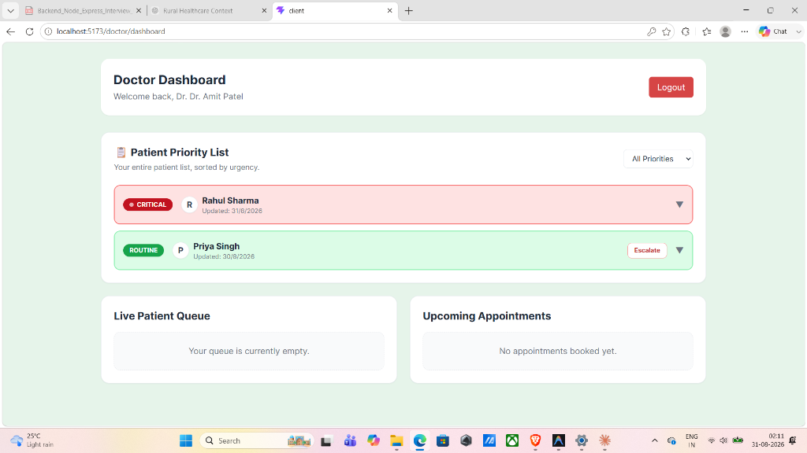
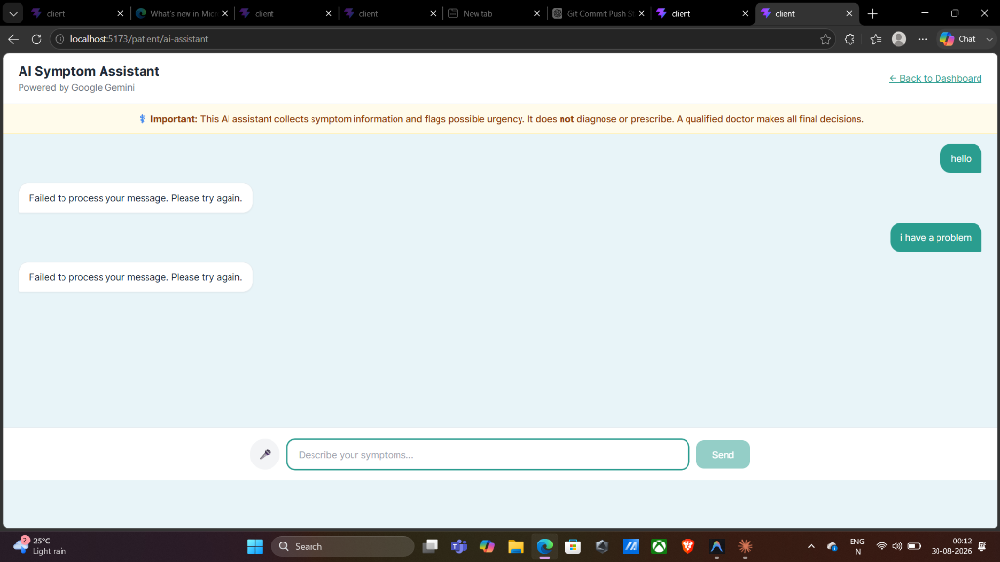
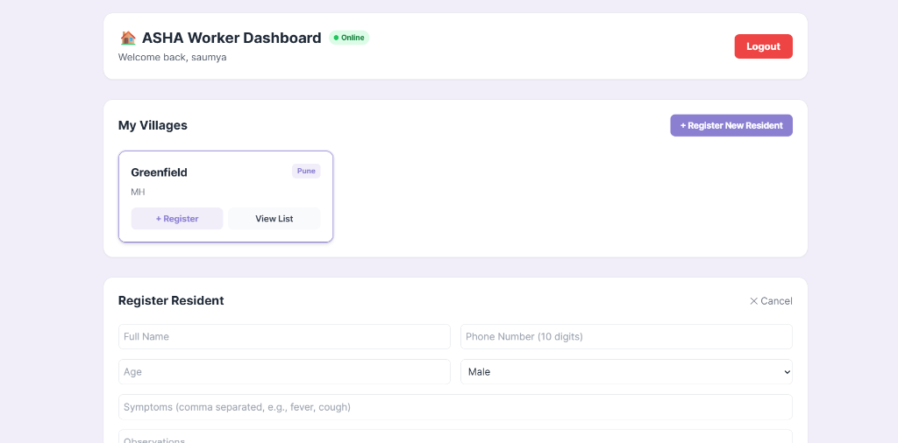
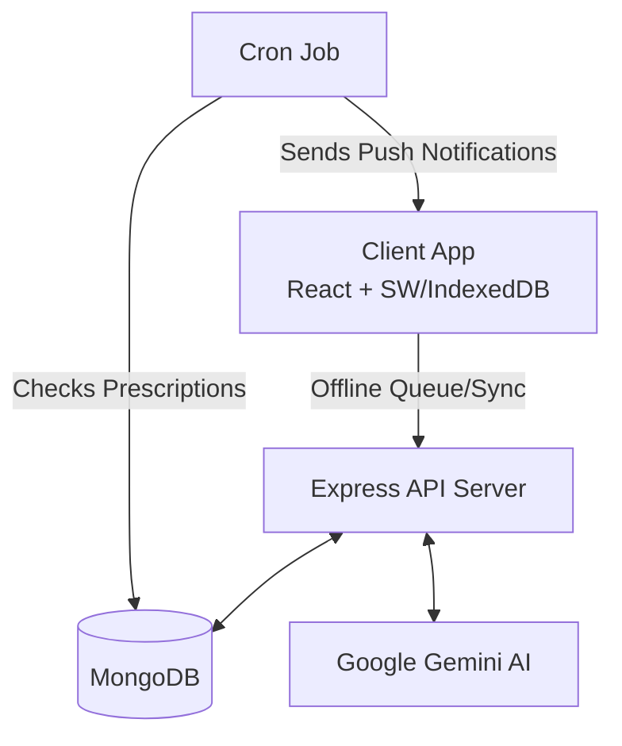

# AI Rural Healthcare System

A comprehensive, AI-driven healthcare platform designed specifically for rural and low-resource environments.


## 🩺 Problem Statement

Rural healthcare suffers from a severe shortage of doctors, overwhelming patient loads, and significant language barriers. ASHA workers on the ground face poor internet connectivity and lack digital tools to efficiently triage and track patients, leading to delayed interventions for critical cases.

## 💡 Solution Overview

This system bridges the gap between field workers (ASHAs), patients, and doctors. It provides an offline-first mobile web app for ASHAs to log data in the field, a multilingual AI triage assistant for patients to report symptoms, and a prioritized dashboard for doctors to efficiently manage critical cases.

## 📸 Screenshots

<p align="center">
  
  <br />
  <em>Doctor Priority Dashboard — AI-powered patient queue sorted by urgency with village filtering</em>
</p>

<p align="center">
  
  <br />
  <em>AI Symptom Assistant — Multilingual voice & text triage powered by Google Gemini</em>
</p>

<p align="center">
  
  <br />
  <em>ASHA Worker Dashboard — Offline-first patient registration and village management</em>
</p>

## 🌟 Key Features

### 1. Multilingual Voice AI Triage
- **Voice & Text Interface:** Patients can interact in English or Hindi using the Web Speech API.
- **Intelligent Triage:** AI collects symptoms and creates a concise summary for the doctor.
- **Safety Boundary:** The AI is restricted from diagnosing or prescribing. Red Flag symptoms trigger an immediate hardcoded emergency warning and escalate the patient to Critical priority.
- **Symptom Quick-Select:** Interactive chips for common symptoms with visual outlines for severe indicators.

### 2. ASHA Worker Offline-First Field App
- **Offline Registration & Reporting:** ASHAs can register patients and log vitals without an active internet connection.
- **Background Sync:** Uses Service Workers and IndexedDB to queue local data and silently sync to the server upon reconnection.
- **Village Patient Lists:** Dedicated views for ASHAs to manage residents in their assigned villages.

### 3. Doctor Priority Dashboard & Village Filtering
- **AI-Powered Priority Queue:** Patients are sorted (Routine, Medium, High, Critical) based on triage data.
- **Village-Level Filtering:** Allows doctors to filter queues geographically to spot local trends.
- **Comprehensive Patient History:** Tabbed interface for AI summaries, ASHA field records, local photo uploads, and past prescriptions.

### 4. Automated Reminders
- **Cron Jobs:** Background tasks run periodically to check active prescriptions.
- **Push Notifications:** The system sends Web Push notifications to remind patients to take medications.

### 5. Admin Village Management
- Admins can create and manage Villages (District, State).
- Centralized registration and assignment of ASHA workers to specific villages.

## 🏗 System Architecture


*For more details, see [Architecture Documentation](docs/architecture.md).*

## 🛠 Tech Stack

| Domain | Technologies |
|---|---|
| **Frontend** | React, Vite, Tailwind CSS, IndexedDB, Web Speech API |
| **Backend** | Node.js, Express.js |
| **Database** | MongoDB Atlas, Mongoose |
| **AI / Triage** | Google Gemini Flash |
| **Services** | Web Push (Notifications), Multer (Local Uploads) |

## 👥 Roles & Permissions

| Role | Key Capabilities |
|---|---|
| **Admin** | Create villages, register and assign ASHA workers, view system-wide stats. |
| **ASHA Worker** | View assigned village residents, register new patients, log vitals, upload photos/reports (offline-capable). |
| **Patient** | Access AI symptom triage (text/voice), receive medication reminders, view their own prescriptions and reports. |
| **Doctor** | View prioritized patient queue, filter by village, review AI summaries/ASHA records, write prescriptions. |

## 📂 Project Structure

```text
AI Rural Healthcare System
├── client/                 # React frontend application
│   ├── public/             # Static assets and Service Worker (sw.js)
│   └── src/                # React components, i18n, and IndexedDB logic
└── server/                 # Node.js Express backend
    ├── scripts/            # Database seeding and migration scripts
    └── src/
        ├── controllers/    # Request handlers for routes
        ├── cron/           # Scheduled jobs for reminders
        ├── middleware/     # JWT Auth and Multer upload middleware
        ├── models/         # Mongoose database schemas
        ├── routes/         # Express API route definitions
        └── services/       # External integrations (Gemini, Web Push, PDF generation)
```

## 🚀 Getting Started

### Prerequisites
- **Node.js**: v18.x or higher
- **MongoDB**: A MongoDB Atlas account or local instance
- **Gemini API Key**: For AI triage capabilities
- **VAPID Keys**: For Web Push notifications (generate via `npx web-push generate-vapid-keys`)

### Setup Instructions

1. **Clone the repository**
   ```bash
   git clone <repo-url>
   cd "AI Rural Healthcare System"
   ```

2. **Install Server Dependencies**
   ```bash
   cd server
   npm install
   ```

3. **Install Client Dependencies**
   ```bash
   cd ../client
   npm install
   ```

4. **Configure Environment Variables**
   Copy the example environment files and fill in your details:
   ```bash
   # In the server directory
   cp .env.example .env
   
   # In the client directory
   cp .env.example .env
   ```

   **Server Variables:**
   | Variable | Description |
   |---|---|
   | `PORT` | Server port (default: 5000) |
   | `MONGO_URI` | MongoDB connection string |
   | `JWT_SECRET` | Secret key for JWT authentication |
   | `CLIENT_URL` | Frontend URL for CORS |
   | `GEMINI_API_KEY` | Google Gemini API key |
   | `VAPID_PUBLIC_KEY` | Web Push public key |
   | `VAPID_PRIVATE_KEY` | Web Push private key |
   | `VAPID_SUBJECT` | Web Push subject (mailto:your@email.com) |

   **Client Variables:**
   | Variable | Description |
   |---|---|
   | `VITE_API_URL` | Backend API URL |
   | `VITE_VAPID_PUBLIC_KEY` | Web Push public key |

5. **Seed the Database**
   ```bash
   cd ../server
   npm run seed
   ```

6. **Run the Application**
   - **Terminal 1 (Backend):**
     ```bash
     cd server
     npm run dev
     ```
   - **Terminal 2 (Frontend):**
     ```bash
     cd client
     npm run dev
     ```

## 🔐 Default Demo Credentials

These credentials are created by the seed script for local demonstration purposes only. Do not use them in production.

| Role | Email | Password |
|---|---|---|
| **Admin** | admin@example.com | password |
| **Doctor** | doctor@example.com | password |
| **ASHA Worker** | asha1@example.com | password |

## 🚀 How to Run the Demo (End-to-End Script)

Follow this script to demonstrate the full capabilities of the system.

### Step 1: Admin Setup
1. Go to `http://localhost:5173/` and log in as the default admin (`admin@example.com` / `password`).
2. **Create a Village**: Go to the Admin Dashboard and add a village (e.g., "Malanpur").
3. **Register ASHA**: Create a new ASHA worker (e.g., "asha1@example.com").
4. **Assign ASHA**: Assign the newly created ASHA to the "Malanpur" village.
5. Log out.

### Step 2: ASHA Field Work (Offline Demonstration)
1. Log in as the ASHA worker (`asha1@example.com`).
2. **Go Offline:** Open Chrome DevTools (F12) -> Network tab -> Change "No throttling" to "Offline".
3. **Register Patient:** Notice the header says "Offline". Click "Register New Resident" under Malanpur.
4. Fill out the registration form for a new patient (e.g., "Ramesh") and submit. The toast will say "Saved offline".
5. **Upload Photo:** Go to Ramesh's profile and add a new Field Record. Upload a photo of a rash and log vitals. Submit.
6. **Go Online:** In DevTools, switch back to "No throttling". Within seconds, the header will turn green ("Online") and a toast will confirm "2 records synced successfully."
7. Log out.

### Step 3: Patient AI Triage (Multilingual & Voice)
1. Log in as the newly created patient (Ramesh).
2. Go to the **AI Symptom Assistant**.
3. **Language & Chips:** Change the language dropdown to **Hindi**. Notice the UI updates.
4. **Voice Input:** Click the microphone icon. Speak a symptom in Hindi (e.g., "मुझे बुखार है").
5. **Safety Boundary:** The AI will respond in Hindi and read it out loud. Next, click the **"Chest pain"** quick-select chip (outlined in red) and send it.
6. The AI will intercept this Red Flag and immediately output an URGENT WARNING, escalating the priority.
7. Click "Submit to Doctor". Log out.

### Step 4: Doctor Review & Prescription
1. Log in as the doctor (`doctor@example.com`).
2. **Dashboard:** You will see Ramesh at the very top of the list with a **CRITICAL** pulsing badge.
3. **Filters:** Use the Village dropdown to filter by "Malanpur".
4. **History:** Expand Ramesh's drawer. Click through the tabs:
   - **AI Consultations:** Shows the Hindi chat summary (translated/keyed in English for the doctor).
   - **ASHA Field Records:** Shows the vitals and the rash photo uploaded earlier.
5. **Prescribe:** Click "Start Telemedicine Consult". Write a prescription and set the duration to 5 days. Submit.

### Step 5: Reminders
1. Open your terminal where the backend is running.
2. The cron job runs periodically to check active prescriptions.
3. It will detect the active prescription and fire off a Web Push Notification reminder to the patient.

## 📡 API Overview

| Method | Endpoint | Role Required | Purpose |
|---|---|---|---|
| `POST` | `/api/auth/login` | None | Authenticate user and issue JWT |
| `GET` | `/api/admin/stats` | Admin | Retrieve system-wide statistics |
| `POST` | `/api/asha/patients/:id/photo` | ASHA | Upload patient photo/vitals |
| `POST` | `/api/ai/chat` | Patient | Send messages to Gemini AI triage |
| `GET` | `/api/doctor/queue` | Doctor | Fetch prioritized patient queue |
| `POST` | `/api/prescriptions` | Doctor | Create a new prescription for a patient |

## ⚠️ AI Safety & Limitations

- **Triage Only:** The AI is strictly programmed to perform triage. It does **not** diagnose conditions or prescribe medications.
- **Red Flag Escalation:** Certain critical keywords (e.g., chest pain, severe bleeding) immediately bypass the AI logic and trigger a hardcoded emergency response.
- **Not a Medical Device:** This system is for demonstration and administrative prioritization only.
- **AI Imperfections:** Responses generated by the Google Gemini model may be imperfect or contextually limited.
- **Data Privacy:** Do not enter real Protected Health Information (PHI) into this system as it sends text directly to external AI APIs.

## 🔮 Roadmap / Future Scope

- **Video Consultations:** Integrate WebRTC for live telemedicine calls between doctors and patients.
- **WhatsApp Integration:** Fallback notification delivery via WhatsApp for patients without smartphones.
- **Expanded Languages:** Add support for additional regional Indian languages beyond English and Hindi.
- **Advanced Analytics:** Predictive modeling to identify potential disease outbreaks at the village level.
- **Diagnostic Device Integration:** Direct Bluetooth sync with digital thermometers and blood pressure monitors for ASHA workers.

## ✍️ Author
**Amar**
B.Tech IT, Rungta College of Engineering and Technology, Bhilai
[] | [amarjaiswal1306@gmail.com]

## 📄 License
This project is licensed under the MIT License.
