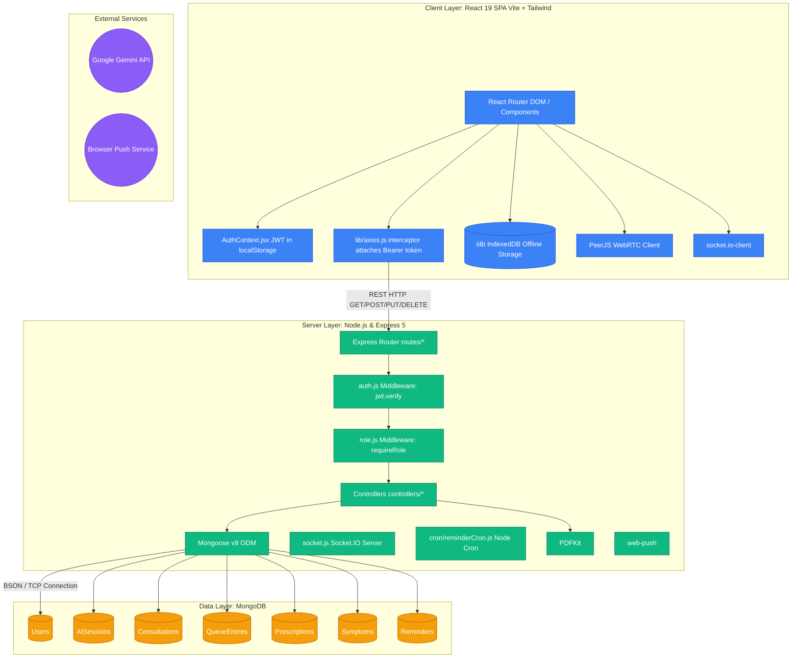
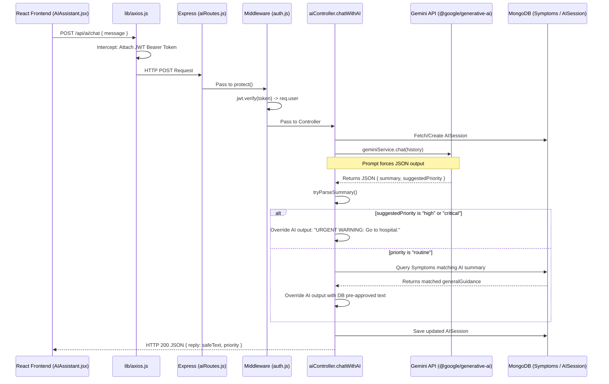
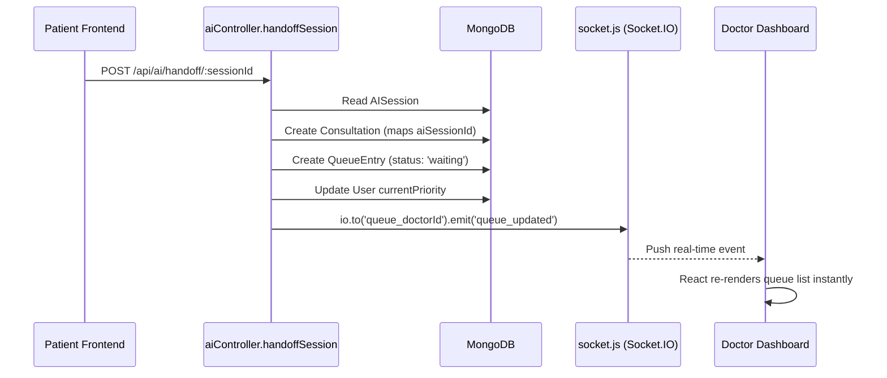
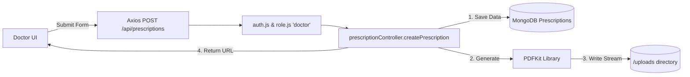
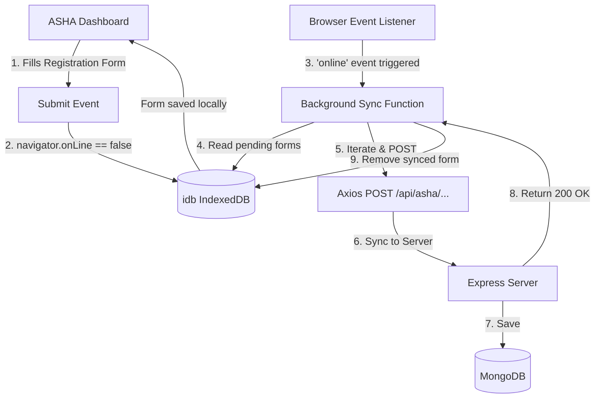
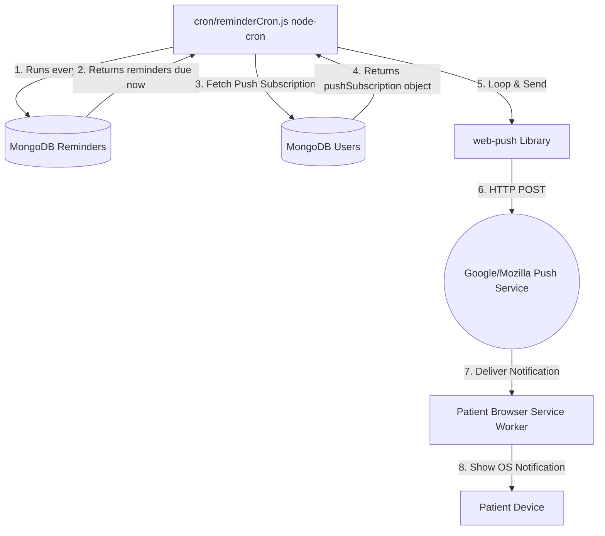

# End-to-End Architecture & Workflow Diagrams

This document contains technically accurate, code-based Mermaid diagrams illustrating the complete architecture and specific workflows of the **AI Rural Healthcare System**. 

These diagrams map exactly to your project's source code implementation and are perfect for a senior technical interview presentation.

## 1. High-Level End-to-End Architecture
This diagram shows the complete structural flow from the React frontend, through the network layer, into the Express backend, and down to MongoDB.



---

## 2. AI Triage Flow & Safety Boundary
This workflow illustrates how user input is sent to Gemini, how the JSON response is intercepted, and how it is mapped against the local Symptoms database to prevent hallucinations and ensure safe medical advice.



---

## 3. Doctor Handoff & Real-time Queue
This details what happens when a patient is flagged for consultation and transferred to a doctor.



---

## 4. Telemedicine (WebRTC & Socket.io Signaling)
The exact flow of negotiating a P2P video call using Socket.io to trade IDs, and PeerJS to establish the WebRTC connection.

```mermaid
sequenceDiagram
    participant Patient as Patient (TelemedicineRoom.jsx)
    participant SocketServer as Node.js Socket.IO Server
    participant Doctor as Doctor (TelemedicineRoom.jsx)
    participant STUN as STUN/TURN Servers

    Note over Patient,Doctor: Both join Socket.IO room "consultation_xyz"
    
    Doctor->>SocketServer: emit('join_room', roomId, peerId)
    SocketServer-->>Patient: broadcast('user_connected', peerId)
    
    Patient->>STUN: Request Public IP/ICE Candidates
    STUN-->>Patient: Return ICE Candidates
    
    Patient->>Patient: PeerJS peer.call(doctorPeerId, localStream)
    Note over Patient,Doctor: Signaling happens under the hood via Socket.IO
    
    Doctor->>Doctor: peer.on('call') -> call.answer(localStream)
    
    Patient<<=>>Doctor: WebRTC P2P UDP Audio/Video Stream established!
```

---

## 5. E-Prescription & PDF Generation Flow
How prescriptions are securely saved in the database and converted into downloadable PDFs.



---

## 6. ASHA Worker Offline Sync Flow
How IndexedDB allows ASHA workers to register patients in areas without cellular service.



---

## 7. Medication Reminders & Push Notifications
The background architecture for automated patient notifications.


